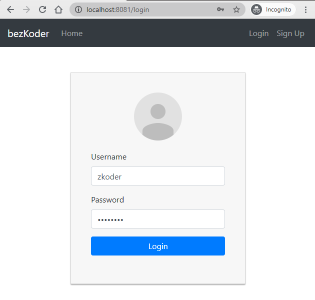

## Redux-toolkit Authentication & Authorization example

- JWT Authentication & Authorization Flow for User Login, Register, Logout
- Project Structure for React Redux JWT Authentication, Router, Axios
- Working with Redux Actions, Reducers, Store using redux-toolkit
- Storing JWT in HttpOnly Cookies
- Creating React Function Components with Hooks & Form Validation
- React Function Components for accessing protected Resources (Authorization)
- Dynamic Navigation Bar in React App

For more detail, please visit:
> [React Redux Authentication & Authorization example with Redux-toolkit](https://www.bezkoder.com/redux-toolkit-auth/)

Signup Page:


Login Page:



For Authorized account login (Moderator for example), the navigation bar will change:


Working with back-end servers:
> [Spring Boot + H2](https://www.bezkoder.com/spring-boot-security-jwt/)

> [Spring Boot + MySQL/PostgreSQL](https://www.bezkoder.com/spring-boot-login-example-mysql/)

> [Spring Boot + MongoDB](https://www.bezkoder.com/spring-boot-mongodb-login-example/)

> [Node Express + MySQL/PostgreSQL](https://www.bezkoder.com/node-js-express-login-example/)

> [Node Express + MongoDB](https://www.bezkoder.com/node-js-express-login-mongodb/)

Related Posts (without redux-toolkit):
> [React Redux Login, Logout, Registration example with Hooks](https://bezkoder.com/react-login-example-jwt-hooks/)

Fullstack (JWT Authentication & Authorization example):
> [React + Spring Boot](https://www.bezkoder.com/spring-boot-react-jwt-auth/)

> [React + Node Express](https://www.bezkoder.com/react-express-authentication-jwt/)

This project was bootstrapped with [Create React App](https://github.com/facebook/create-react-app).

### Project setup

In the project directory, you can run:

```
npm install
# or
yarn install
```

or

### Compiles and hot-reloads for development

```
npm start
# or
yarn start
```

Open [http://localhost:8081](http://localhost:8081) to view it in the browser.

The page will reload if you make edits.

### Related Posts
> [In-depth Introduction to JWT-JSON Web Token](https://www.bezkoder.com/jwt-json-web-token/)

> [React CRUD example using Hooks](https://www.bezkoder.com/react-hooks-crud-axios-api/)

> [React Pagination using Hooks example](https://www.bezkoder.com/react-pagination-hooks/)

> [React Hooks File Upload example](https://www.bezkoder.com/react-hooks-file-upload/)

> [React Form Validation with Hooks example](https://bezkoder.com/react-form-validation-hooks/)

Fullstack with Node Express:
> [React + Node Express + MySQL](https://www.bezkoder.com/react-node-express-mysql/)

> [React + Node Express + PostgreSQL](https://www.bezkoder.com/react-node-express-postgresql/)

> [React + Node Express + MongoDB](https://www.bezkoder.com/react-node-express-mongodb-mern-stack/)

Fullstack with Spring Boot:
> [React + Spring Boot + MySQL](https://www.bezkoder.com/react-spring-boot-crud/)

> [React + Spring Boot + PostgreSQL](https://www.bezkoder.com/spring-boot-react-postgresql/)

> [React + Spring Boot + MongoDB](https://www.bezkoder.com/react-spring-boot-mongodb/)

Fullstack with Django:
> [React Hooks + Django Rest Framework](https://www.bezkoder.com/django-react-hooks/)

Serverless:
> [React Hooks Firebase Realtime Database: CRUD App ](https://www.bezkoder.com/react-firebase-hooks-crud/)

> [React Hooks Firestore example: CRUD App](https://www.bezkoder.com/react-hooks-firestore/)

Integration (run back-end & front-end on same server/port)
> [Integrate React with Spring Boot](https://www.bezkoder.com/integrate-reactjs-spring-boot/)

> [Integrate React with Node Express](https://www.bezkoder.com/integrate-react-express-same-server-port/)